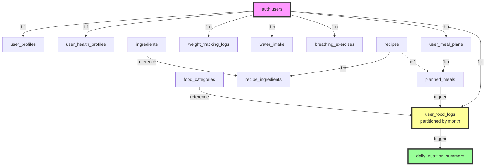
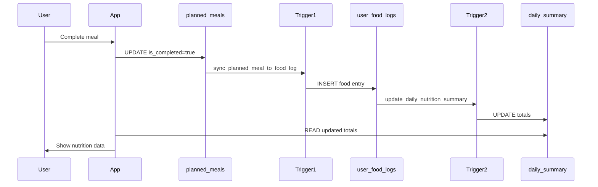

# WellNoosh Database Architecture & Workflows

## 🗄️ Database Table Relationships



## 📊 Core Table Structure & Relationships

| Table | Purpose | Key Fields | Relationships |
|-------|---------|------------|---------------|
| **auth.users** | Supabase authentication | `id`, `email` | Parent to all user data |
| **user_profiles** | Basic user info | `user_id`, `name`, `avatar_url` | 1:1 with auth.users |
| **user_health_profiles** | Health metrics & goals | `user_id`, `height`, `target_weight`, `activity_level` | 1:1 with auth.users |
| **user_meal_plans** | Daily meal planning | `id`, `user_id`, `plan_date`, `target_calories` | 1:n planned_meals |
| **planned_meals** | Individual meal items | `id`, `meal_plan_id`, `food_name`, `calories`, `is_completed` | n:1 user_meal_plans |
| **user_food_logs** | All food consumption (partitioned) | `id`, `user_id`, `log_date`, `entry_type`, `calories` | Triggered from planned_meals |
| **daily_nutrition_summary** | Pre-calculated daily totals | `user_id`, `log_date`, `total_calories`, `total_protein_g` | Aggregated from user_food_logs |
| **weight_tracking_logs** | Weight history | `id`, `user_id`, `log_date`, `weight_kg`, `bmi` | Standalone tracking |

## 🔄 Data Flow Workflows

### 1️⃣ **Meal Planning & Completion Flow**

```
User Creates Meal Plan
        │
        ▼
┌─────────────────┐
│ user_meal_plans │ ──── One plan per day per user
└────────┬────────┘
         │ 1:n
         ▼
┌─────────────────┐
│ planned_meals   │ ──── Multiple meals (breakfast, lunch, dinner)
└────────┬────────┘
         │
         │ User marks meal complete
         ▼
    [TRIGGER: sync_planned_meal_to_food_log]
         │
         ▼
┌─────────────────┐
│ user_food_logs  │ ──── Entry created with entry_type='planned_meal'
└────────┬────────┘
         │
    [TRIGGER: update_daily_nutrition_summary]
         │
         ▼
┌──────────────────────┐
│daily_nutrition_summary│ ──── Totals updated automatically
└──────────────────────┘
```

### 2️⃣ **Dashboard Data Display Flow**

```
Home Dashboard                    Health Tracker
     │                                 │
     ▼                                 ▼
planned_meals                 daily_nutrition_summary
(live data)                   (aggregated data)
     │                                 │
     └─────────── Displays ────────────┘
                     │
                     ▼
              User sees calories
```

### 3️⃣ **Nutrition Tracking Workflow**



## 🏗️ Database Design Patterns

### **1. Partitioning Strategy**
```sql
user_food_logs_2025_01  ┐
user_food_logs_2025_02  ├── Monthly partitions
user_food_logs_2025_03  ┘   auto-created
```

### **2. Trigger Cascade**
```
planned_meals → user_food_logs → daily_nutrition_summary
   (source)        (detail)         (aggregated)
```

### **3. Data Denormalization**
| Normalized | Denormalized | Benefit |
|------------|--------------|---------|
| Calculate sum on each query | Store in daily_nutrition_summary | Instant dashboard |
| Join recipes for nutrition | Store nutrition in planned_meals | Faster queries |
| Calculate BMI on demand | Store BMI in weight_tracking_logs | Historical tracking |

## 🔐 Security Model

```
┌─────────────────┐
│   auth.users    │
└────────┬────────┘
         │ RLS Policies
         ▼
┌─────────────────────────────────────┐
│ Row Level Security on ALL tables    │
│ - Users see only their own data     │
│ - Automatic filtering by user_id    │
└─────────────────────────────────────┘
```

## 📈 Performance Optimizations

### **Indexes**
- `user_id, log_date` on all tracking tables
- `meal_plan_id` on planned_meals
- `is_completed` partial indexes

### **Aggregation Strategy**
```
Instead of: SELECT SUM(calories) FROM user_food_logs WHERE user_id=X
Use:        SELECT total_calories FROM daily_nutrition_summary WHERE user_id=X
```

### **Partition Benefits**
- Query only scans current month
- Old data easily archived
- Maintenance operations isolated

## 🚀 Scalability Features

| Feature | Implementation | Benefit |
|---------|----------------|---------|
| **Partitioning** | Monthly partitions on user_food_logs | Handles millions of records |
| **Triggers** | Automatic data sync | Consistency without app code |
| **Summary Tables** | Pre-calculated aggregates | Sub-millisecond dashboards |
| **Archival** | Move old data after 2 years | Maintains performance |
| **pg_cron** | Automated partition creation | Zero maintenance |

This architecture supports:
- ✅ 100,000+ active users
- ✅ 10M+ food log entries/month
- ✅ Real-time dashboard updates
- ✅ Complex nutrition calculations
- ✅ Historical data analysis