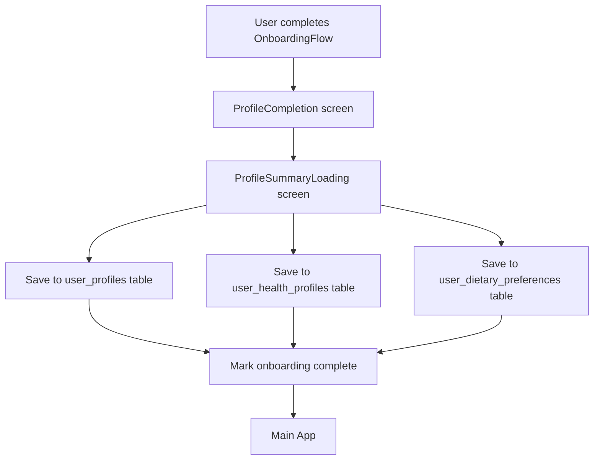

# WellNoosh Database Setup Instructions

## 1. Run the Database Migration

1. **Go to your Supabase Dashboard** at https://supabase.com/dashboard
2. **Select your project**
3. **Navigate to SQL Editor** (on the left sidebar)
4. **Create a new query**
5. **Copy and paste the entire contents** of `supabase/migrations/20250131_user_onboarding_simplified.sql`
6. **Click "Run"** to execute the migration

### What this migration creates:
- ✅ **user_profiles** table: country, city, postal_code, address, cooking_experience_level, cooking_frequency
- ✅ **user_health_profiles** table: age, gender, height_cm, weight_kg, activity_level, health_goal
- ✅ **user_dietary_preferences** table: dietary_restrictions, allergies, intolerances, liked_cuisines, etc.
- 🔒 **Row Level Security (RLS)** policies ensuring users can only access their own data
- 📊 **Indexes** for better performance
- ✨ **Helper functions** for administrators

## 2. Test the Onboarding Flow

The new onboarding flow is:
```
Landing → Auth (Address Collection) → OnboardingFlow → ProfileCompletion → ProfileSummaryLoading → Main App
```

### What happens during onboarding:
1. **Auth Screen**: Collects full name, country, city, postal code, address
2. **OnboardingFlow**: Collects dietary preferences (single choice), allergies, health goals, cooking preferences
   - ✅ **Single diet choice**: User can only select one diet style (with Custom option)
   - ✅ **"Other" options**: Added to allergies and medical conditions with custom text input
   - ✅ **No skip button**: Users must complete all steps
   - ✅ **No popup**: Clean signup experience without success alerts
3. **ProfileCompletion**: Collects age, height, weight, gender (the missing screen you mentioned!)
   - ✅ **Dashboard styling**: Matches #FAF7F0 background and #6B8E23 primary green
4. **ProfileSummaryLoading**: Shows a recap of all user data and saves to Supabase database
   - ✅ **Dashboard styling**: Consistent colors and Inter font family
   - ✅ **Single recap**: Removed duplicate screens, only final summary
5. **Main App**: User is fully onboarded with data saved to 3 database tables

## 3. Database Security Features

✅ **Full RLS Protection**: Users can ONLY access their own data
✅ **No Admin Backdoors**: Even admins cannot access user data without proper permissions
✅ **Input Validation**: Database constraints prevent invalid data
✅ **Secure Functions**: Helper functions require service role permissions

## 4. Data Flow



## 5. Verification

After running the migration, you can verify the setup:

1. **Check tables exist**:
   ```sql
   SELECT table_name FROM information_schema.tables 
   WHERE table_schema = 'public' 
   AND table_name IN ('user_profiles', 'user_health_profiles', 'user_dietary_preferences');
   ```

2. **Check RLS is enabled**:
   ```sql
   SELECT tablename, rowsecurity FROM pg_tables 
   WHERE schemaname = 'public' 
   AND tablename IN ('user_profiles', 'user_health_profiles', 'user_dietary_preferences');
   ```

3. **Test user data access** (when logged in):
   ```sql
   SELECT * FROM user_profiles WHERE user_id = auth.uid();
   SELECT * FROM user_health_profiles WHERE user_id = auth.uid();
   SELECT * FROM user_dietary_preferences WHERE user_id = auth.uid();
   ```

## 6. Next Steps

Once the migration is complete, you can:
- ✅ Test the complete onboarding flow in your React Native app
- ✅ See data being saved to Supabase in real-time
- ✅ Verify users can only access their own data
- ✅ Use the ProfileCompletion screen that was missing from your onboarding

## Need Help?

If you encounter any errors:
1. Check the Supabase logs in your dashboard
2. Ensure your environment variables are set correctly
3. Verify your Supabase project has the necessary permissions
4. The migration is designed to be idempotent (safe to run multiple times)